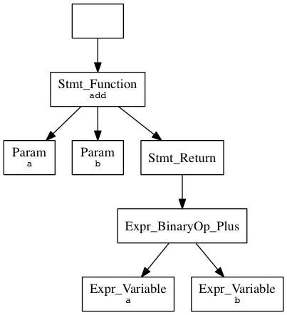

AST dot dumper for nikic/php-parser
===============================

Command shipped with this library:

```bash
bin/phpparser-visualize tests/cases/simple.php | dot -Tpng -o simple.png
```

Contents of `simple.php` visualized in example command:
```php
<?php

function add($a, $b) {
	return $a + $b;
}
```

Output `simple.png``:


